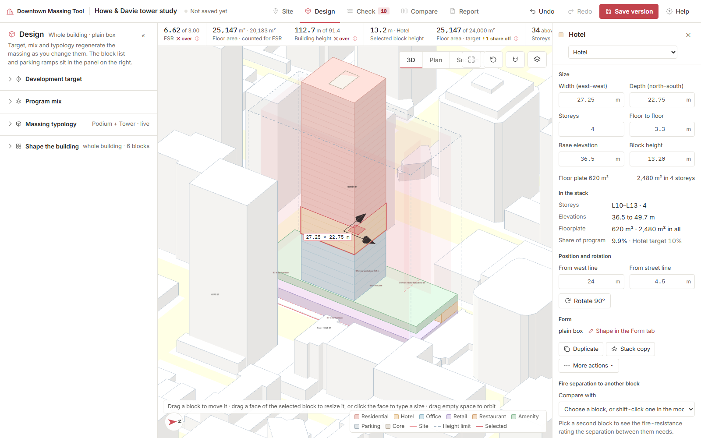
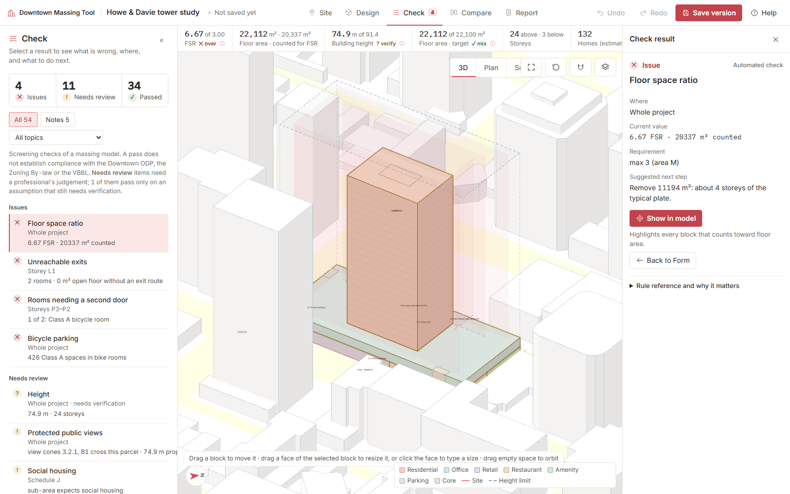

# Downtown Massing Tool

**Live tool:** https://xubynii.github.io/dtmass/ · Repository: https://github.com/xubynii/dtmass

## 1. Purpose

Downtown Massing Studio helps designers explore a downtown Vancouver tower project before a code consultant is involved. Users choose a program mix and massing typology to see how their brief could fit on a specific lot, then adjust the shape, split floors, and rearrange uses. The tool checks supported building code and planning requirements to identify which constraints need attention first, such as density, height, setbacks, or parking. Designers can test several options quickly and see how each change affects the proposal. A generated report records the comparisons, explains potential compliance issues, and preserves the reasons for choosing one scheme over another, including assumptions and questions that need further review.

## 2. How to use it

The tool is a static web page (HTML and JavaScript, no build step, no account).

**Online:** open the live link at the top of this README in Chrome or Edge on a laptop-sized screen. The first load fetches about 7 MB (the downtown context model, the City parcel data and the Rhino reader); after that it is cached.

**Workflow (Site → Design → Check → Compare → Report):**
1. **Site.** The demo opens on 1189 Howe St. *Change site* opens a map of downtown parcels; click one. Under *Restrictions*, confirm the ODP density area, the ODP height area and any view-cone height: items marked *Needs verification* were guessed from City data and keep every dependent check at "needs verification" until you confirm them. Choose the guideline setback set (Downtown South residential street, retail street build-to, or none).
2. **Design.** *Development target*: target gross floor area, preferred tower floorplate, optional height target, parking levels, floor-to-floor per use. *Program mix*: shares of gross floor area above grade for residential, hotel, office, retail, restaurant and amenity; the total must be 100% (*Normalize*). *Massing typology*: Slender Tower, Podium + Tower, Split Towers on a Shared Podium, Courtyard Podium + Tower, each with position and proportion parameters. Every change regenerates the massing live; one undo step per change. The panel shows requested against generated area per use and names conflicts (height, FSR, floor plate) with the adjustment that would resolve them. *Shape the building*: taper, twist, tiers, stack, terraces, voids, storey edits or an uploaded Rhino `.3dm` massing.
3. **Edit in 3D.** Click a block to select it; drag its body to move it on its own floor (the level never changes by dragging); on the selected block, dragging a face pushes or pulls it (storeys snap), dragging the roof changes the height, and only a drag that slides clearly along a face moves the block; click a face to type an exact dimension. Street names lie flat along every street in view in bold italic capitals, the site's own streets largest and centred on each site edge; they turn to stay readable as you orbit, and where one of your blocks hides a name it shows faintly through. Blocks cannot be moved past the guideline setback lines. The floor a block starts on is set in the right panel (Base elevation or *Starts at*). The right panel edits size, storeys, floor-to-floor, position and program, lists every block with its storey range, and shows the fire-separation rating to a second block (shift-click it).
4. **Check.** Every check with its current value, the requirement, the clause (linked) and a suggested next step. *Show in model* highlights the blocks or storey concerned.
5. **Compare.** Save versions; compare two with matched axonometrics, program-stack diagrams and metric differences.
6. **Report.** A printable document: project data sheet, synopsis, findings, capacity, constraints, recommended moves, appendix of all checks with linked sources. Print to PDF from the browser.

Keyboard: Ctrl+Z / Ctrl+Shift+Z undo and redo, Esc cancels a drag, Alt ignores snapping, H hides and L locks the selected block.

## 3. Sources

| Rule set | Version or date | Used for |
|---|---|---|
| Vancouver Building By-law 2025 (No. 14275), Division B Part 3 | in force 15 Sep 2025; in-stream to 8 Mar 2027 | travel distance 3.4.2.5, exit separation 3.4.2.3, dead ends 3.3.1.9.(5), exit widths 3.4.3.2 and Table 3.4.3.2.-A, second egress door Table 3.3.1.5.-B, dwelling single egress 3.3.4.4.(7), high building 3.2.6, single exterior stair 3.2.10.1 (20 Jan 2026), storage garages 3.3.5, construction articles 3.2.2.47–3.2.2.93, fire separations Table 3.1.3.1, occupant loads Table 3.1.17.1 |
| BC Building Code 2024 | 2024, rev. July 2024 | Part 3 text where the VBBL does not differ; Table 3.1.3.1 values |
| Downtown Official Development Plan (By-law 4912) | consolidated June 2026 | density §3(1) and Map 1, residential cap §3(3)–(4), exclusions §3(5)–(7), height §4 Table 1 and Map 3, view cones §4.4 and Map 4, daylight §5 Figure 2, ground-floor retail §2 and Map 2 |
| Residential Tower Floor Plates bulletin | June 2025 | plate limits by frontage and neighbouring towers (Tables 1–3) |
| Downtown South Guidelines (excluding Granville Street) | 1991, amended to 2019; figures as quoted in Council and Development Permit Board reports | 3.7 m front setback, 12.2 m from interior lines above 21.3 m, 3.0 m rear rising to 9.1 m above 10.7 m, 24.4 m tower separation |
| Downtown Design Guidelines | §1, §6.2.4 | build-to line on retail streets, shopfront width |
| Public Views Guidelines (replaced the View Protection Guidelines) | 10 July 2024 | view-cone heights are entered by hand per site |
| Solar Access Guidelines for the Downtown Peninsula | Council 17 Sep 2025 | new shadow on listed parks, equinox 10:00–16:00 |
| Parking By-law No. 6059 and Parking and Loading Design Supplement | consolidations 2024–2026 | no minimums downtown §4.1.1, non-residential maximum §4.2.5, visitor §4.1.3, accessible §4.1.4, stall and aisle sizes §4.5, ramps, headroom, loading §5.2, bicycle §6.2, EV §4.11.1 |
| Granville Street Plan; Higher Buildings Policy (H005); Green Buildings Policy for Rezonings (July 2023); Zoning and Development By-law Schedule J | as dated | context notes and the energy requirement on the data sheet; not checked numerically |
| City of Vancouver Open Data (parcels, zoning, view cones, sub-areas); OpenStreetMap contributors (ODbL) | 2026 | site data and the surrounding buildings |

Every clause shown in the tool is a link to the by-law, code section, bulletin or guideline it comes from (`src/links.js` holds the addresses). Transcribed values live in `src/codes.js`.

## 4. One example

Input: the demo site **1189 Howe St** (DD, density area M, FSR 3.00, height area 6, 91.4 m basic) with a brief of **24,000 m²**, mix **55% residential · 10% hotel · 15% office · 8% retail · 4% restaurant · 8% amenity**, 620 m² floorplate, two parking levels, typology **Podium + Tower**.

Result: a 3-storey podium of retail, restaurant and amenity, a 4-storey office band, a hotel block and a residential tower to 112.7 m; the generator reports 25,147 m² generated against 24,000 m² requested and two conflicts: the height exceeds the 91.4 m basic height by 21.3 m, and FSR 6.62 exceeds the 3.00 permitted, each with the floorplate or area that would resolve it.

The Check tab for the same scheme, with a failing item open and its clause linked:

## 5. Skill and limits

**Reusable pieces.** `src/codes.js` (transcribed rule values with clauses), `src/rules.js` (the checks), `src/links.js` (clause-to-source resolver) and `src/gen.js` (the typology generator) are plain scripts with no dependencies on the interface and can be reused in other tools.

**What the tool does not do, and where a person must check:**
- It is a screening tool. A pass does not establish compliance with the ODP, the Zoning By-law or the VBBL; a code consultant and the City's own interpretation govern.
- The ODP density area, height area and view-cone heights are read from City layers that do not carry the ODP sub-area boundaries exactly; confirm them on ODP Maps 1, 3 and 4 before trusting any density or height result.
- Guideline setbacks use the Downtown South figures as quoted in Council reports; check the guideline that applies to your sub-area and street.
- Floor plans, homes, stalls, egress distances and fire separations come from automatically generated plans on a 0.25 m grid with assumed stair widths and corridor rules; they show whether a massing can work, not a design.
- Energy (VBBL Part 10, Green Buildings Policy) is listed on the data sheet but not modelled.
- Shadows and daylight use simplified geometry (axis-aligned blocks, equinox sun positions); view cones are not modelled geometrically.
- Hotel floors are planned like residential floors and treated as Group C.
- Tested in Chrome and Edge on a laptop screen; the 3D view needs WebGL.

## Repository layout

`src/` the web page and its scripts · `tools/` local server, headless tests and screenshot scripts · `docs/` specification, architecture notes, slide text, demo script and screenshots · `CHANGELOG.md` the phase-by-phase development log.
